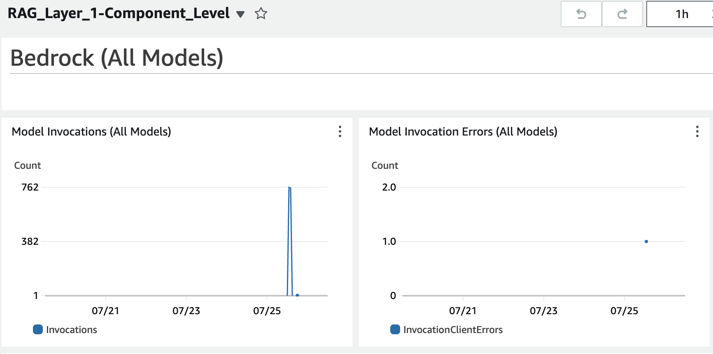

# Observability reference blueprint 

This project has reference designs for observability for GenAI applications including the following features:

- **RAG Blueprint**: A reference sample implementation of a Retrieval-Augmented Generation (RAG) model, which combines a retrieval component (vector database) with a language model to generate responses based on relevant documents.
- **Multi-level Observability**: Includes four levels of observability:
  1. **Component-level Metrics**: Basic utilization and consumption metrics for the application, Bedrock, ingest pipeline, and vector database.
  2. **Traces**: X-Ray traces for Langchain activity.
  3. **User Feedback**: MLFlow integration for recording user feedback as experiment runs.
  4. **Advanced Metrics**: Ragas for evaluating precision, recall, and harmfulness, along with user feedback metrics.
- **Dashboards**: CloudWatch dashboards for monitoring component-level metrics, and a Grafana dashboard for a unified view.
- **Prometheus Integration**: Prometheus CloudWatch exporter for pushing metrics to Prometheus.

## Blueprint: RAG

In the folder `cdk-llm-observability-ref-impl-rag` is a CDK project to implement this blueprint.


### Deployment

#### Prerequisites

You need to have:

* A Route53 public hosted zone. A registered domain is also required to attach certificates.
* Docker, NodeJS, and CDK installed
* Foundation Model Access enabled in the US-EAST-1 region
* AWS account part of an AWS Organization

#### Domain names

Pick two domain names under your hosted zone. One will be for the ALB and the other will be for the front-end URL. For example, if your hosted zone is `foo.com`, you could pick:

    `alb.foo.com`
    `app.foo.com`

#### CDK

If this is your first time deploying this repo, make sure you install the node packages by entering the the command below in the `cdk` repo

```
npm install
```

There are four contect values required to build and deploy the CDK stack:
- appCustomDomainName: Custom Domain Name to be used for Frontend App
- loadBalancerOriginCustomDomainName: Custom Domain Name to be used for Load Balancer Origin
- customDomainRoute53HostedZoneID: Route53 Hosted Zone ID for the Custom Domain being used
- customDomainRoute53HostedZoneName: Route53 Hostedzone Name

Go into the `cdk-llm-observability-ref-impl-rag` directory. Enter the four context values in a file called `cdk.context.json` in the `cdk` directory.
Then run the following commands:

    cdk synth
    cdk deploy --all --outputs-file cdk.out.json

Alternatively, you can enter the four context values directly from the command line:

    cdk synth
    cdk deploy --all \
    -c appCustomDomainName=<Enter Custom Domain Name to be used for Frontend App> \
    -c loadBalancerOriginCustomDomainName=<Enter Custom Domain Name to be used for Load Balancer Origin> \
    -c customDomainRoute53HostedZoneID=<Enter Route53 Hosted Zone ID for the Custom Domain being used> \
    -c customDomainRoute53HostedZoneName=<Enter Route53 Hostedzone Name> \
    --outputs-file cdk.out.json

While building the stack, you may encounter pip install timeout issues. If this occurs, try to increase the PIP_DEFAULT_TIMEOUT environment variable e.g.:

    export PIP_DEFAULT_TIMEOUT=100

#### Cognito

Create a Cognito user in the user pool created in the last step.

Your password must comply with the password policy, which requires:

- Minimum 8 Characters
- A mix of lower and uppercase characters
- At least one numeric character
- At least one symbol

### Testing

Open the app using the URL given in the CDK output `AppURL`. You will need to login with the Cognito identity created in the last step, and then change the password.

#### General chat

You can enter any query in the `Chat` tab.

#### RAG

You can download some sample government reports on the food industry here:

* [GAO-23-105846](https://www.gao.gov/products/gao-23-105846)
* [BR2023-0012](https://apps.fas.usda.gov/newgainapi/api/Report/DownloadReportByFileName?fileName=Retail+Foods_Sao+Paulo+ATO_Brazil_BR2023-0012)

Upload these documents to the S3 location given by the CDK output `BucketIngestPath`. Then put questions in the `RAG` tab.

You can then ask a question like: 

    How much did retail food prices increase from 2021-2022?

### Metrics and observability

#### Level 1 - Component-level metrics

This layer includes basic utilization and consumption metrics from the application, Bedrock, the ingest pipeline, and the vector database.

The CDK stack creates several CloudWatch dashboards for this level.

* `RAG_Layer_1-Component_Level-Models` for details about Bedrock model use
* `RAG_Layer_1-Component_Level-Vector_DB` for details about vector database use
* `RAG_Layer_1-Component_Level-SFN` for details about the Step Functions workflow used to convert PDFs into embeddings 
* `RAG_Layer_1-Component_Level-App` for details about the Streamlit app



#### Level 2 - Traces

You will see X-Ray traces for Langchain activity.


#### Level 3 - User feedback

We use MLFlow to record user feedback as an experiment run. To access MLFlow you need to ensure that the default execution role configured for SageMager Studio has proper access to the MLFlow tracking server. Below is an example of an IAM policy you could use:

```
{
    "Version": "2012-10-17",
    "Statement": [
        {
            "Sid": "MLFlowTrackingAccess",
            "Effect": "Allow",
            "Action": "sagemaker-mlflow:*",
            "Resource": <arn of ML Flow Tracking server>
        }
    ]
}
```

In SageMaker Studio, open the MLFlow tracking server (the tracking server ARN is in the CDK output). You will see experiment runs recording the input, output, and user feedback.


#### Level 4 - Advanced metrics

We use Ragas to evaluate precision, recall, and harmfulness for the RAG application.  These metrics are presented in the dashboard `RAG_Layer_4-Ragas`.

There's also a summary dashboard for user feedback metrics, `RAG_Layer_4-Feedback`.

#### Grafana

We can use Grafana for a single pane of glass dashboard. To use Grafana, first create a user in IAM Identity Center. Then assign this user to the Grafana workspace we created via CDK.

Next, configure a [CloudWatch data source in Grafana](https://docs.aws.amazon.com/grafana/latest/userguide/adding--CloudWatch-manual.html). The workspace role already has the required permissions. 

CDK does not have a way to pre-configure a dashboard, so you can build your own using the same metrics as we use in the CloudWatch dashboards created by CDK. For example, here's a chart showing the Bedrock input token count over the past 24 hours.


For the sake of completeness, we also use the Prometheus CloudWatch exporter to push CloudWatch metrics to Prometheus.

## Caveats

This code is for demonstration purposes only. It is not production-ready out of the box. If you wish to wish it in production, consider adding more features, including:

* Using dead-letter queues for Lambda functions
* Using reserved concurrency for Lambda functions to avoid throttling
* Implementing better container health checks for the application and the Prometheus exporter

## Security

See [CONTRIBUTING](CONTRIBUTING.md#security-issue-notifications) for more information.

## License

This library is licensed under the MIT-0 License. See the LICENSE file.
